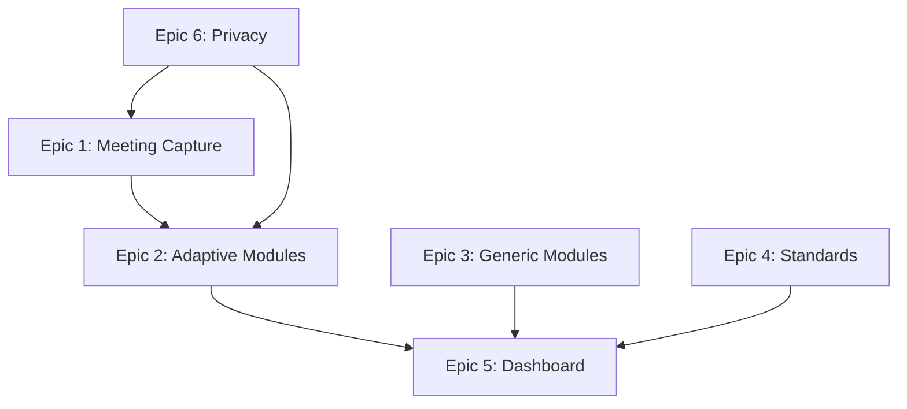

# Detailed Project Requirements: ShipSpeak
## Epic-Based Development Structure

**Version:** 1.0  
**Date:** October 2025  
**Document Type:** Backlog & Epic Breakdown  

---

## Overview

This document breaks down the ShipSpeak PRD into actionable epics with user stories and acceptance criteria. The platform's core innovation is the **Meeting Intelligence** creating a continuous learning loop: capture real meetings → analyze performance → generate adaptive modules → practice → improve.

---

## 🎯 Epic 1: Meeting Capture & Debrief (Hybrid Architecture)

**Goal:** Enable users to capture meetings across all major platforms using appropriate capture methods (extension, desktop, or bot).

### User Stories

**Story 1.1: Platform-Specific Capture Setup**
- **As a** PM using different meeting platforms  
- **I want to** capture meetings regardless of platform  
- **So that** I get consistent feedback across all my meetings  

**Acceptance Criteria:**
- [ ] **Google Meet**: Chrome extension auto-activates for tab capture
- [ ] **Zoom Desktop**: Desktop app captures system audio
- [ ] **Zoom Web**: Extension captures via WebRTC
- [ ] **Teams**: Desktop app or bot option available
- [ ] Platform detection happens automatically
- [ ] User sees which capture method is active
- [ ] Consent flow appropriate to capture method
- [ ] Audio processed consistently regardless of source
- [ ] User can pause/stop recording at any time

**Story 1.1a: Desktop App Installation**
- **As a** Zoom desktop user  
- **I want to** quickly install the desktop companion  
- **So that** I can capture my Zoom meetings  

**Acceptance Criteria:**
- [ ] One-click download for detected OS
- [ ] Installation completes in <2 minutes
- [ ] Auto-updater keeps app current
- [ ] Runs in system tray/menu bar
- [ ] Visual indicator when recording
- [ ] Clean uninstall process

**Story 1.2: Post-Meeting Debrief Generation**
- **As a** PM who just finished a meeting  
- **I want to** receive a comprehensive debrief of my performance  
- **So that** I can understand my strengths and weaknesses  

**Acceptance Criteria:**
- [ ] Debrief available within 5 minutes of meeting end
- [ ] Shows transcript of user's contributions only
- [ ] Displays 3 key scores: Clarity, Confidence, Structure
- [ ] Highlights specific moments (buried lead, filler words, etc.)
- [ ] Includes "missed opportunities" analysis
- [ ] Provides rewritten examples of key statements

**Story 1.3: Privacy Controls**
- **As a** user handling sensitive information  
- **I want to** control what's captured and retained  
- **So that** I maintain confidentiality  

**Acceptance Criteria:**
- [ ] Consent toggles for each participant
- [ ] Option to redact sensitive portions
- [ ] Data retention settings (24hr, 7 days, 30 days)
- [ ] Ability to permanently delete any recording
- [ ] Zero-knowledge processing option

**Dependencies:**
- Chrome Extension: WebRTC Tab Capture API
- Desktop App: Electron framework
- AssemblyAI API for real-time transcription
- Platform detection logic
- OS-specific audio capture (CoreAudio/WASAPI/PulseAudio)
- Diarization for speaker isolation

---

## 🎯 Epic 2: Adaptive Module Engine

**Goal:** Automatically generate personalized practice modules based on meeting analysis.

### User Stories

**Story 2.1: Pattern Detection & Module Generation**
- **As a** PM with meeting feedback  
- **I want to** receive auto-generated practice modules targeting my weaknesses  
- **So that** I can immediately practice what I need to improve  

**Acceptance Criteria:**
- [ ] System identifies top 3 improvement areas from meeting
- [ ] Generates 2-3 targeted practice modules per meeting
- [ ] Modules reference actual content from the meeting
- [ ] Each module has clear learning objective
- [ ] Difficulty adapts based on user's current level
- [ ] Time estimate provided (5-min, 15-min, 30-min options)

**Story 2.2: Module Personalization**
- **As a** PM practicing  
- **I want to** have modules that feel relevant to my work  
- **So that** practice directly improves my job performance  

**Acceptance Criteria:**
- [ ] Modules use user's industry context
- [ ] Incorporates user's actual product/company terminology  
- [ ] Adapts to user's role level (IC, Senior, Director)
- [ ] References user's upcoming meetings for prep
- [ ] Progressively increases difficulty as user improves

**Story 2.3: Practice-to-Performance Tracking**
- **As a** user who completed practice modules  
- **I want to** see how practice improved my next meeting  
- **So that** I know the training is working  

**Acceptance Criteria:**
- [ ] System tracks which modules were completed
- [ ] Compares pre/post practice meeting scores
- [ ] Shows specific improvements in targeted areas
- [ ] Celebrates wins when weaknesses become strengths
- [ ] Adjusts future modules based on effectiveness

**Dependencies:**
- GPT-4 for module content generation
- Pattern matching algorithms
- User progress database

---

## 🎯 Epic 3: Generic Module Library

**Goal:** Provide always-available baseline practice modules for core PM skills.

### User Stories

**Story 3.1: Core Skill Modules**
- **As a** PM wanting to practice fundamentals  
- **I want to** access proven practice drills anytime  
- **So that** I can build strong baseline skills  

**Acceptance Criteria:**
- [ ] 20+ generic modules available at launch
- [ ] Categories: Answer-First, Trade-offs, Metrics, Exec Presence
- [ ] Each module has 3 difficulty levels
- [ ] Clear instructions and examples provided
- [ ] Can be completed in 5-15 minutes
- [ ] Voice recording and AI feedback included

**Story 3.2: Module Discovery & Selection**
- **As a** user browsing modules  
- **I want to** easily find relevant practice exercises  
- **So that** I can focus on what matters most  

**Acceptance Criteria:**
- [ ] Modules displayed as stackable cards
- [ ] Filter by skill area, duration, difficulty
- [ ] Search by keyword or situation
- [ ] Recommended modules based on profile
- [ ] Progress tracking for each module
- [ ] Bookmark favorites for quick access

**Module Examples:**
- **"60-Second Elevator Pitch"** - State recommendation in 1 minute
- **"The Trade-off Drill"** - Articulate pros/cons clearly
- **"Metrics That Matter"** - Connect features to business metrics
- **"Managing Up"** - Adapt message for executive audience
- **"Technical Translation"** - Explain complex concepts simply

**Dependencies:**
- Content management system
- Module template framework
- Progress tracking system

---

## 🎯 Epic 4: Standards Modules

**Goal:** Align practice with company-specific leadership principles and frameworks.

### User Stories

**Story 4.1: Framework Selection**
- **As a** PM at a specific company  
- **I want to** practice using our leadership principles  
- **So that** I align with company culture and expectations  

**Acceptance Criteria:**
- [ ] Pre-built modules for Amazon LPs, Meta, Google, Microsoft
- [ ] Can select company framework during onboarding
- [ ] Modules automatically adapt to selected framework
- [ ] Examples use company-specific language
- [ ] Can switch frameworks anytime
- [ ] Option to upload custom company principles

**Story 4.2: Standards-Based Exercises**
- **As a** PM preparing for performance review  
- **I want to** practice articulating work through our principles  
- **So that** I excel in company-specific evaluations  

**Acceptance Criteria:**
- [ ] Each principle has dedicated exercises
- [ ] Real scenario practice (e.g., "Dive Deep" for Amazon)
- [ ] Feedback evaluates alignment with principles
- [ ] STAR format coaching for behavioral responses
- [ ] Mock interview mode for each principle
- [ ] Progress tracking per principle

**Framework Examples:**
- **Amazon**: Customer Obsession, Ownership, Invent and Simplify, Dive Deep
- **Meta**: Move Fast, Be Bold, Focus on Impact, Be Open
- **Google**: Focus on the User, It's Best to Do One Thing Really Well
- **Custom**: Upload company values and get tailored modules

**Dependencies:**
- Framework content library
- Custom upload parser
- Principle-based scoring rubrics

---

## 🎯 Epic 5: Dashboard & Progress Tracking

**Goal:** Provide users with clear visibility into their improvement journey.

### User Stories

**Story 5.1: Performance Dashboard**
- **As a** user logging in  
- **I want to** immediately see my progress and next actions  
- **So that** I stay motivated and focused  

**Acceptance Criteria:**
- [ ] Overall communication score with 30-day trend
- [ ] Current skill focus area highlighted
- [ ] Queue of adaptive modules from recent meetings
- [ ] Upcoming meeting prep suggestions
- [ ] Weekly improvement summary
- [ ] Celebration of milestones and wins

**Story 5.2: Skill Progression Tracking**
- **As a** PM working on specific skills  
- **I want to** track detailed progress in each area  
- **So that** I know where to focus effort  

**Acceptance Criteria:**
- [ ] Individual scores for: Clarity, Confidence, Structure, Influence
- [ ] Historical charts showing improvement over time
- [ ] Comparison to peer benchmarks (anonymous)
- [ ] Skill-specific recommendations
- [ ] Export progress for performance reviews
- [ ] Goal setting and tracking

**Story 5.3: Meeting History & Insights**
- **As a** user reviewing past performance  
- **I want to** see patterns across my meetings  
- **So that** I can identify systemic improvements  

**Acceptance Criteria:**
- [ ] Searchable meeting history
- [ ] Filter by meeting type, audience, outcome
- [ ] Pattern analysis across meetings
- [ ] Best/worst performance highlights
- [ ] Contextual insights (e.g., "You're clearer in morning meetings")
- [ ] Team comparison (if enabled)

**Dependencies:**
- Analytics database
- Data visualization library
- Export functionality

---

## 🎯 Epic 6: Privacy & Permissions

**Goal:** Ensure users have complete control over their data with enterprise-grade security.

### User Stories

**Story 6.1: Consent Management**
- **As a** user joining meetings  
- **I want to** control when recording happens  
- **So that** I maintain privacy and trust  

**Acceptance Criteria:**
- [ ] Per-meeting consent toggle
- [ ] Participant notification of recording
- [ ] Ability to exclude specific participants
- [ ] Meeting type rules (never record 1:1s, always record reviews)
- [ ] Visual indicator when recording active
- [ ] Post-meeting consent confirmation

**Story 6.2: Data Control**
- **As a** user concerned about privacy  
- **I want to** control my data retention and usage  
- **So that** I feel secure using the platform  

**Acceptance Criteria:**
- [ ] Choose retention period: 24hr, 7 days, 30 days, permanent
- [ ] Download all personal data
- [ ] Permanently delete account and all data
- [ ] Opt out of anonymized aggregation
- [ ] See audit log of data access
- [ ] Control third-party integrations

**Story 6.3: Enterprise Security**
- **As an** enterprise admin  
- **I want to** ensure platform meets security requirements  
- **So that** we can deploy company-wide  

**Acceptance Criteria:**
- [ ] SOC 2 Type II compliance
- [ ] SSO integration (Okta, Auth0)
- [ ] Role-based access control
- [ ] Data residency options
- [ ] API security with rate limiting
- [ ] Regular security audits

**Dependencies:**
- Authentication system
- Encryption infrastructure
- Compliance certifications
- Audit logging system

---

## 📊 Implementation Priorities

### MVP Scope (Months 1-3)
**Must Have:**
- Epic 1: Meeting Capture via Chrome Extension (Google Meet focus)
- Epic 2: Adaptive Module Engine (key differentiator)
- Epic 6: Privacy & Permissions (trust foundation)

### MVP+ Scope (Months 4-6)
**Platform Expansion:**
- Epic 1: Desktop App for Zoom coverage
- Platform routing and detection logic

### Phase 2 (Months 4-6)
**Should Have:**
- Epic 3: Generic Module Library (baseline value)
- Epic 5: Dashboard & Progress Tracking (engagement)

### Phase 3 (Months 7-9)
**Nice to Have:**
- Epic 4: Standards Modules (enterprise value)
- Advanced features within each epic

---

## 🔗 Cross-Epic Dependencies

**Critical Path:**
1. Privacy & Permissions (foundation)
2. Meeting Capture (data collection)
3. Adaptive Module Engine (core value)
4. Dashboard (user engagement)
5. Generic & Standards Modules (expanded value)

---

## 📝 Technical Assumptions

**Required APIs:**
- AssemblyAI for real-time transcription with diarization
- OpenAI GPT-4 for content generation and analysis
- WebRTC for browser-based audio capture
- OAuth providers for authentication

**Infrastructure:**
- <1 second latency for real-time feedback
- 5-minute max for post-meeting analysis
- 99.9% uptime for recording service
- Horizontal scaling for concurrent users

**Constraints:**
- No raw audio storage (privacy requirement)
- All processing must be consent-based
- Must work across Zoom, Teams, Google Meet
- Mobile app not required for MVP

---

## ✅ Success Criteria

**User Success:**
- 70% of users see measurable improvement in 30 days
- 85% complete at least one adaptive module post-meeting
- NPS score >50

**Business Success:**
- 500 active users in first 6 months
- 25% trial-to-paid conversion
- <$50 CAC with $29-49/month pricing

**Technical Success:**
- <1% recording failure rate per capture method
- Platform coverage: 40% (MVP), 70% (6 months), 100% (12 months)
- <5 minute analysis turnaround
- 99.9% uptime for each capture service
- Zero security breaches

---

## 🚀 Next Steps

1. **Technical Spike:** Test AssemblyAI diarization accuracy
2. **Design Sprint:** Create module card UI/UX
3. **User Research:** Validate consent flow with 10 PMs
4. **MVP Development:** Start with Epic 1 + Epic 2 integration
5. **Alpha Testing:** 50 users for meeting capture feedback

This epic structure provides clear development priorities while maintaining focus on the core innovation: turning real meeting performance into personalized practice opportunities.