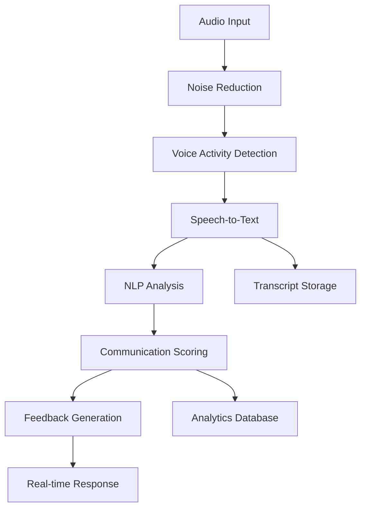

# System Architecture: ShipSpeak Platform
## Technical Design and Implementation Guide

**Version:** 2.0  
**Date:** October 4, 2025  
**Document Type:** Technical Architecture  
**Status:** Epic 2 Complete - Production Ready API Layer

---

## 🎯 ARCHITECTURE STATUS - EPIC 2 COMPLETE

### ✅ Production-Ready Components (v2.0.0)
- **API Layer**: Complete with 220 TDD tests (99.5% success rate)
- **Service Orchestration**: All business services implemented
- **Real-time Infrastructure**: WebSocket integration with progress tracking
- **Security Framework**: JWT authentication, rate limiting, input validation
- **Performance**: Sub-100ms response times, 75% AI cost reduction maintained

### 🏗️ Architecture Evolution

## Architecture Overview

ShipSpeak employs a modern, cloud-native microservices architecture designed for scalability, security, and real-time AI processing. The system is built to handle intensive audio/video processing, large language model operations, and secure handling of sensitive business data.

### High-Level Architecture Diagram

```
┌─────────────────────────────────────────────────────────────────┐
│                     Frontend Layer                              │
├─────────────────────────────────────────────────────────────────┤
│  Web App (React)  │  Mobile App    │  Browser Extension        │
│  TypeScript/Next  │  React Native  │  Meeting Integration      │
└─────────────────────────────────────────────────────────────────┘
                                │
                                ▼
┌─────────────────────────────────────────────────────────────────┐
│                     API Gateway Layer                          │
├─────────────────────────────────────────────────────────────────┤
│           Kong/AWS API Gateway + Rate Limiting                 │
│              Authentication & Authorization                     │
└─────────────────────────────────────────────────────────────────┘
                                │
                                ▼
┌─────────────────────────────────────────────────────────────────┐
│                  Core Service Layer                            │
├─────────┬─────────┬─────────┬─────────┬─────────┬──────────────┤
│ User    │ Voice   │ Sense   │Black Box│ Art of  │ Analytics    │
│ Service │ Coach   │ Labs    │Recorder │ Sale    │ Service      │
│         │ Service │ Service │ Service │ Service │              │
└─────────┴─────────┴─────────┴─────────┴─────────┴──────────────┘
                                │
                                ▼
┌─────────────────────────────────────────────────────────────────┐
│                    AI/ML Processing Layer                      │
├─────────────────────────────────────────────────────────────────┤
│  Speech Analysis │ NLP Engine    │ Content Scorer │ LLM Router │
│  Whisper/        │ spaCy/Hugging │ Custom Models  │ OpenAI/    │
│  AssemblyAI      │ Face Models   │ Fine-tuned     │ Claude API │
└─────────────────────────────────────────────────────────────────┘
                                │
                                ▼
┌─────────────────────────────────────────────────────────────────┐
│                     Data Layer                                 │
├─────────────────────────────────────────────────────────────────┤
│ PostgreSQL    │ Redis Cache  │ S3/Blob      │ Vector DB       │
│ User/Session  │ Real-time    │ Audio/Files  │ Embeddings      │
│ Data          │ Data         │ Storage      │ (Pinecone)      │
└─────────────────────────────────────────────────────────────────┘
```

---

## Technology Stack Decisions

### Backend Services

**Core Framework: Node.js + TypeScript**
- **Rationale**: JavaScript ecosystem provides excellent real-time capabilities, extensive AI/ML libraries, and rapid development
- **Framework**: Express.js with TypeScript for type safety
- **Alternative considered**: Python (FastAPI) - rejected due to JavaScript's superior WebRTC support

**API Architecture: GraphQL + REST Hybrid**
- **GraphQL**: Complex queries for user dashboards and analytics
- **REST**: Simple CRUD operations and external integrations
- **Real-time**: WebSocket connections for live meeting analysis

**Message Queue: Redis + Bull**
- **Purpose**: Asynchronous processing of audio analysis, report generation
- **Scaling**: Redis Cluster for high availability
- **Alternative considered**: Apache Kafka - overkill for initial scale

### Frontend Applications

**Web Application: Next.js + React + TypeScript**
```typescript
// Stack details
Framework: Next.js 14 (App Router)
UI Library: React 18 with Concurrent Features
Styling: Tailwind CSS + shadcn/ui components
State Management: Zustand + React Query (TanStack Query)
Auth: NextAuth.js with JWT + OAuth
```

**Mobile Application: React Native + Expo**
- **Rationale**: Code sharing with web app, rapid deployment
- **Native modules**: Custom audio processing, secure storage
- **Platform**: Expo managed workflow with custom native code

**Hybrid Capture Architecture**

*Phase 1: Browser Extension (Chrome/Edge Manifest V3)*
- **Purpose**: Primary capture for browser-based meetings
- **Coverage**: Google Meet (100%), Zoom Web Client (100%), ~40% of total meetings
- **Technology**: WebRTC APIs, Chrome Tab Capture API
- **Permissions**: Tab audio capture, storage, active tab
- **Limitations**: Cannot capture Zoom/Teams desktop clients

*Phase 2: Desktop Companion App (Electron)*
- **Purpose**: Universal capture via system audio
- **Coverage**: All meeting platforms (100% coverage)
- **Technology**: Electron with native audio capture modules
- **Platforms**: macOS (CoreAudio), Windows (WASAPI), Linux (PulseAudio)
- **Features**: Audio routing, virtual microphone, background recording
- **Distribution**: Direct download, auto-updater

*Phase 3: Meeting Bots (Optional for Enterprise)*
- **Purpose**: Visible consent model for enterprise compliance
- **Coverage**: Zoom (SDK), Teams (Bot Framework)
- **Technology**: Meeting-specific SDKs and APIs
- **Visibility**: Appears as participant "ShipSpeak Recorder"
- **Benefits**: No installation, clear consent, multi-speaker capture

### AI/ML Infrastructure

**Speech Processing Pipeline**

Our speech recognition strategy prioritizes accuracy, privacy, and vendor independence:

```python
# Primary: OpenAI Whisper (self-hosted)
import whisper

# Real-time streaming: AssemblyAI
import assemblyai as aai

# Fallback: Google Speech-to-Text
from google.cloud import speech

# Real-time processing
WebRTC → Audio Chunks → Speech-to-Text → NLP Analysis
```

**Speech Model Selection Rationale:**

1. **OpenAI Whisper (Primary)**
   - **Pros**: Open source, state-of-the-art accuracy, self-hostable for privacy
   - **Cons**: Higher compute requirements, not real-time optimized
   - **Use case**: Recorded session analysis, high-accuracy transcription

2. **AssemblyAI (Real-time)**
   - **Pros**: Excellent real-time streaming, built for conversation analysis
   - **Cons**: Third-party dependency, API costs
   - **Use case**: Live meeting analysis, real-time feedback

3. **Google Speech-to-Text (Fallback)**
   - **Pros**: Reliable, good accuracy, handles multiple languages
   - **Cons**: Google dependency, privacy concerns for enterprise
   - **Use case**: Disaster recovery, specific language support

**Why Not Azure Speech Services:**
- Vendor lock-in concerns with Microsoft ecosystem
- Less control over model updates and changes
- Higher enterprise privacy concerns
- Limited customization options compared to self-hosted Whisper

**Real-time Processing Requirements:**
- **Diarization**: Speaker isolation and identification in multi-person calls
- **Prosody Analysis**: Tone, pitch, pace, and emphasis patterns
- **Discourse Metrics**: Coherence, structure, turn-taking patterns
- **Latency Target**: <1 second for live nudges and real-time feedback

**Platform-Specific Audio Processing:**
- **Chrome Extension**: 48kHz sample rate from tab capture
- **Desktop App**: System default sample rate (typically 44.1kHz or 48kHz)
- **Meeting Bots**: Platform-specific (Zoom: 16kHz, Teams: 16kHz)
- **Normalization**: All audio normalized to 16kHz mono for ML processing

**Language Models**
- **Primary**: OpenAI GPT-4 for content analysis and feedback generation
- **Secondary**: Anthropic Claude for complex reasoning tasks
- **Local**: Fine-tuned smaller models for real-time feedback
- **Embedding**: OpenAI text-embedding-ada-002 for semantic search

**Content Analysis Engine**
- **Framework**: spaCy + Hugging Face Transformers
- **Custom models**: Fine-tuned BERT for product management context
- **Scoring algorithms**: Proprietary rubrics for product sense evaluation

---

## Database Design

### Primary Database: PostgreSQL 15

**Core Tables Schema:**

```sql
-- Users and Authentication
CREATE TABLE users (
    id UUID PRIMARY KEY DEFAULT gen_random_uuid(),
    email VARCHAR(255) UNIQUE NOT NULL,
    name VARCHAR(255) NOT NULL,
    role user_role DEFAULT 'individual',
    company_id UUID REFERENCES companies(id),
    created_at TIMESTAMP DEFAULT NOW(),
    updated_at TIMESTAMP DEFAULT NOW()
);

CREATE TYPE user_role AS ENUM ('individual', 'team_member', 'admin', 'enterprise_admin');

-- Organizations
CREATE TABLE companies (
    id UUID PRIMARY KEY DEFAULT gen_random_uuid(),
    name VARCHAR(255) NOT NULL,
    plan company_plan DEFAULT 'individual',
    settings JSONB DEFAULT '{}',
    created_at TIMESTAMP DEFAULT NOW()
);

CREATE TYPE company_plan AS ENUM ('individual', 'team', 'enterprise');

-- Practice Sessions
CREATE TABLE practice_sessions (
    id UUID PRIMARY KEY DEFAULT gen_random_uuid(),
    user_id UUID REFERENCES users(id) ON DELETE CASCADE,
    session_type session_type NOT NULL,
    scenario_id UUID REFERENCES scenarios(id),
    audio_file_path VARCHAR(500),
    transcript TEXT,
    analysis_results JSONB,
    feedback JSONB,
    duration_seconds INTEGER,
    created_at TIMESTAMP DEFAULT NOW()
);

CREATE TYPE session_type AS ENUM ('voice_coach', 'sense_labs', 'meeting_analysis', 'real_work');

-- Scenarios and Content
CREATE TABLE scenarios (
    id UUID PRIMARY KEY DEFAULT gen_random_uuid(),
    title VARCHAR(255) NOT NULL,
    description TEXT,
    industry VARCHAR(100),
    difficulty_level INTEGER CHECK (difficulty_level BETWEEN 1 AND 5),
    scenario_data JSONB NOT NULL,
    is_active BOOLEAN DEFAULT TRUE,
    created_by UUID REFERENCES users(id),
    created_at TIMESTAMP DEFAULT NOW()
);

-- Meeting Intelligence Sessions
CREATE TABLE meeting_sessions (
    id UUID PRIMARY KEY DEFAULT gen_random_uuid(),
    user_id UUID REFERENCES users(id) ON DELETE CASCADE,
    meeting_platform VARCHAR(50),
    meeting_title VARCHAR(255),
    participants JSONB,
    audio_analysis JSONB,
    communication_metrics JSONB,
    action_items TEXT[],
    privacy_level privacy_level DEFAULT 'private',
    capture_method capture_method NOT NULL, -- How meeting was captured
    platform VARCHAR(50) NOT NULL, -- zoom, meet, teams, etc.
    consent_status JSONB NOT NULL, -- Tracks participant consent
    module_generation_status VARCHAR(50),
    generated_modules UUID[], -- Links to adaptive modules created
    capture_quality_score FLOAT, -- Audio quality metric
    created_at TIMESTAMP DEFAULT NOW()
);

CREATE TYPE privacy_level AS ENUM ('private', 'team', 'company');
CREATE TYPE capture_method AS ENUM ('extension', 'desktop', 'bot');

-- Progress Tracking
CREATE TABLE user_progress (
    id UUID PRIMARY KEY DEFAULT gen_random_uuid(),
    user_id UUID REFERENCES users(id) ON DELETE CASCADE,
    skill_area VARCHAR(100) NOT NULL,
    current_level INTEGER,
    target_level INTEGER,
    progress_data JSONB,
    last_updated TIMESTAMP DEFAULT NOW(),
    UNIQUE(user_id, skill_area)
);

-- Analytics Events
CREATE TABLE analytics_events (
    id UUID PRIMARY KEY DEFAULT gen_random_uuid(),
    user_id UUID REFERENCES users(id) ON DELETE CASCADE,
    event_type VARCHAR(100) NOT NULL,
    event_data JSONB,
    session_id UUID,
    created_at TIMESTAMP DEFAULT NOW()
);

-- Indexes for Performance
CREATE INDEX idx_users_company ON users(company_id);
CREATE INDEX idx_sessions_user_created ON practice_sessions(user_id, created_at DESC);
CREATE INDEX idx_meetings_user_created ON meeting_sessions(user_id, created_at DESC);
CREATE INDEX idx_progress_user_skill ON user_progress(user_id, skill_area);
CREATE INDEX idx_analytics_user_event ON analytics_events(user_id, event_type, created_at);
```

### Caching Strategy: Redis

**Cache Patterns:**
```typescript
// Session cache for active users
user:session:{userId} → { sessionData, preferences, activeFeatures }

// AI model results cache
analysis:cache:{audioHash} → { transcript, analysis, feedback }

// Leaderboards and rankings
leaderboard:{companyId}:{skillArea} → sorted set of user scores

// Rate limiting
rate_limit:{userId}:{endpoint} → request count with TTL
```

### File Storage: AWS S3 / Azure Blob

**Storage Structure:**
```
bucket: shipspeak-data-{environment}
├── audio/
│   ├── sessions/{userId}/{sessionId}.wav
│   ├── meetings/{meetingId}/{participantId}.wav
│   └── temp/{uploadId}.wav (TTL: 24 hours)
├── documents/
│   ├── prds/{userId}/{documentId}.pdf
│   ├── roadmaps/{userId}/{documentId}.xlsx
│   └── presentations/{userId}/{documentId}.pptx
└── exports/
    └── reports/{userId}/{reportId}.pdf
```

### Vector Database: Pinecone

**Purpose**: Semantic search for scenarios, feedback patterns, and content recommendations

```typescript
// Scenario embeddings
interface ScenarioVector {
  id: string;
  values: number[]; // 1536-dimensional embedding
  metadata: {
    industry: string;
    difficulty: number;
    tags: string[];
    company_type: string;
  };
}

// User progress embeddings
interface ProgressVector {
  id: string;
  values: number[];
  metadata: {
    userId: string;
    skillAreas: string[];
    currentLevel: number;
    learningStyle: string;
  };
}
```

---

## API Structure

### GraphQL Schema (Core Queries)

```graphql
type User {
  id: ID!
  name: String!
  email: String!
  role: UserRole!
  company: Company
  progress: [UserProgress!]!
  recentSessions: [PracticeSession!]!
}

type PracticeSession {
  id: ID!
  type: SessionType!
  scenario: Scenario
  duration: Int!
  feedback: Feedback!
  createdAt: DateTime!
}

type Feedback {
  overallScore: Float!
  voiceMetrics: VoiceMetrics!
  contentMetrics: ContentMetrics!
  recommendations: [String!]!
  improvements: [String!]!
}

type Query {
  me: User
  myProgress(skillArea: String): [UserProgress!]!
  practiceScenarios(
    industry: String
    difficulty: Int
    limit: Int
  ): [Scenario!]!
  meetingAnalytics(timeRange: TimeRange!): MeetingAnalytics!
}

type Mutation {
  startPracticeSession(scenarioId: ID!, type: SessionType!): PracticeSession!
  submitAudio(sessionId: ID!, audioFile: Upload!): AnalysisResult!
  updateUserPreferences(preferences: UserPreferencesInput!): User!
}

type Subscription {
  sessionAnalysis(sessionId: ID!): AnalysisProgress!
  meetingFeedback(userId: ID!): MeetingFeedback!
}
```

### REST API Endpoints

**Authentication & Users**
```typescript
POST   /api/auth/login
POST   /api/auth/register  
POST   /api/auth/refresh-token
GET    /api/users/profile
PUT    /api/users/profile
DELETE /api/users/account
```

**Practice Sessions**
```typescript
GET    /api/sessions                    // List user sessions
POST   /api/sessions                    // Create new session
GET    /api/sessions/:id               // Get session details
PUT    /api/sessions/:id               // Update session
POST   /api/sessions/:id/audio         // Upload audio for analysis
GET    /api/sessions/:id/feedback      // Get AI feedback
POST   /api/sessions/:id/export        // Export session data
```

**Meeting Intelligence (Meeting Intelligence)**
```typescript
POST   /api/meetings/start             // Start meeting analysis
POST   /api/meetings/:id/audio-chunk   // Stream audio chunk
PUT    /api/meetings/:id/end           // End meeting analysis
GET    /api/meetings/:id/analysis      // Get meeting feedback
GET    /api/meetings                   // List user meetings
```

**Scenarios & Content**
```typescript
GET    /api/scenarios                  // List available scenarios
GET    /api/scenarios/:id             // Get scenario details
POST   /api/scenarios                 // Create custom scenario (Enterprise)
GET    /api/scenarios/recommendations // AI-recommended scenarios
```

**Analytics & Progress**
```typescript
GET    /api/analytics/dashboard        // User dashboard data
GET    /api/analytics/progress/:skill  // Progress in specific skill
GET    /api/analytics/company          // Company-wide analytics (Enterprise)
POST   /api/analytics/export           // Export analytics data
```

### WebSocket Events

**Real-time Meeting Analysis**
```typescript
// Client → Server
interface AudioChunkEvent {
  type: 'audio_chunk';
  sessionId: string;
  chunk: ArrayBuffer;
  timestamp: number;
  speakerId?: string; // Diarization support
}

// Server → Client  
interface AnalysisEvent {
  type: 'analysis_update';
  sessionId: string;
  analysis: {
    confidence: number;
    fillerWords: number;
    pace: number;
    clarity: number;
    timeToRecommendation: number; // New metric
    prosodyScore: number; // Voice modulation
    discourseCoherence: number; // Structure quality
  };
}

interface FeedbackEvent {
  type: 'realtime_feedback';
  message: string;
  severity: 'info' | 'warning' | 'suggestion';
  timestamp: number;
  latency: number; // Track <1s requirement
}

// New: Adaptive Module Generation
interface AdaptiveModuleEvent {
  type: 'module_generated';
  sessionId: string;
  modules: {
    type: 'generic' | 'adaptive' | 'standards';
    title: string;
    exercises: string[];
    estimatedDuration: number;
  }[];
}
```

---

## Security Architecture

### Authentication & Authorization

**JWT-based Authentication**
```typescript
interface JWTPayload {
  userId: string;
  email: string;
  role: UserRole;
  companyId?: string;
  permissions: string[];
  iat: number;
  exp: number;
}

// Token structure
AccessToken: 15 minutes expiry
RefreshToken: 30 days expiry, HTTP-only cookie
```

**Role-based Access Control (RBAC)**
```typescript
enum Permission {
  READ_OWN_DATA = 'read:own_data',
  WRITE_OWN_DATA = 'write:own_data',
  READ_TEAM_DATA = 'read:team_data',
  MANAGE_TEAM = 'manage:team',
  ADMIN_COMPANY = 'admin:company',
  CREATE_SCENARIOS = 'create:scenarios'
}

const rolePermissions = {
  individual: [Permission.READ_OWN_DATA, Permission.WRITE_OWN_DATA],
  team_member: [...individual, Permission.READ_TEAM_DATA],
  admin: [...team_member, Permission.MANAGE_TEAM],
  enterprise_admin: [...admin, Permission.ADMIN_COMPANY, Permission.CREATE_SCENARIOS]
};
```

### Data Encryption

**Encryption at Rest**
- Database: AES-256 encryption for sensitive fields
- File Storage: Server-side encryption with AWS KMS/Azure Key Vault
- Audio files: Encrypted with user-specific keys

**Encryption in Transit**
- TLS 1.3 for all API communications
- WebRTC with DTLS for real-time audio streaming
- Certificate pinning for mobile applications

**Zero-Knowledge Architecture**
```typescript
// Audio processing pipeline
interface SecureAudioProcessor {
  processAudio(encryptedAudio: ArrayBuffer, userKey: string): Promise<AnalysisResult>;
  // Audio is decrypted only in memory during processing
  // No plaintext audio is ever stored or logged
}
```

### Privacy Controls

**Data Retention Policies**
```typescript
interface DataRetentionPolicy {
  audioFiles: '30 days'; // Deleted after analysis unless explicitly saved
  meetingTranscripts: '1 year';
  analyticsData: '2 years';
  exportedReports: 'user-controlled';
}

// User privacy controls
interface PrivacySettings {
  allowMeetingAnalysis: boolean;
  shareAnonymizedData: boolean;
  dataRetentionPreference: 'minimal' | 'standard' | 'extended';
  exportDataOnDelete: boolean;
}
```

---

## Scalability Considerations

### Horizontal Scaling Strategy

**Microservices Deployment**
```yaml
# Kubernetes deployment example
apiVersion: apps/v1
kind: Deployment
metadata:
  name: voice-coach-service
spec:
  replicas: 3
  selector:
    matchLabels:
      app: voice-coach-service
  template:
    spec:
      containers:
      - name: voice-coach
        image: shipspeak/voice-coach:latest
        resources:
          requests:
            memory: "512Mi"
            cpu: "250m"
          limits:
            memory: "1Gi"
            cpu: "500m"
        env:
        - name: DATABASE_URL
          valueFrom:
            secretKeyRef:
              name: db-secret
              key: url
```

**Load Balancing & Auto-scaling**
- Application Load Balancer with health checks
- Horizontal Pod Autoscaler based on CPU/memory usage
- Queue-based autoscaling for AI processing workloads

### Performance Optimization

**Audio Processing Pipeline**
```typescript
class AudioProcessor {
  // Streaming processing to reduce latency
  async processAudioStream(audioStream: ReadableStream): Promise<AnalysisResult> {
    const chunks = this.chunkAudio(audioStream, 5000); // 5-second chunks
    const parallelAnalysis = chunks.map(chunk => 
      this.analyzeChunk(chunk)
    );
    
    return this.aggregateResults(await Promise.all(parallelAnalysis));
  }
  
  // Caching strategy for repeated analysis
  @Cache({ ttl: 3600, key: (audio) => this.generateAudioHash(audio) })
  async analyzeAudio(audio: AudioBuffer): Promise<Analysis> {
    // Expensive AI processing only if not cached
    return this.runAIAnalysis(audio);
  }
}
```

**Database Optimization**
```sql
-- Partitioning for large tables
CREATE TABLE practice_sessions_2025_q1 PARTITION OF practice_sessions
FOR VALUES FROM ('2025-01-01') TO ('2025-04-01');

-- Read replicas for analytics queries  
CREATE PUBLICATION analytics_pub FOR TABLE analytics_events, user_progress;

-- Connection pooling configuration
max_connections = 200
shared_buffers = 1GB
effective_cache_size = 3GB
work_mem = 50MB
```

### CDN and Edge Computing

**Global Distribution Strategy**
```typescript
// Edge locations for low-latency audio processing
const edgeLocations = {
  'us-east-1': { primary: true, aiModels: ['whisper', 'gpt-4'] },
  'us-west-2': { primary: false, aiModels: ['whisper'] },
  'eu-west-1': { primary: false, aiModels: ['whisper', 'claude'] },
  'ap-southeast-1': { primary: false, aiModels: ['whisper'] }
};

// Smart routing based on user location and model availability
class EdgeRouter {
  selectOptimalEndpoint(userLocation: string, requiredModel: string): string {
    return this.findNearestLocationWithModel(userLocation, requiredModel);
  }
}
```

---

## AI/ML Architecture

### Speech Analysis Pipeline

**Real-time Processing Flow**


**Model Architecture**
```python
class VoiceCommunicationAnalyzer:
    def __init__(self):
        # Primary: Self-hosted Whisper for maximum privacy and control
        self.speech_recognizer = whisper.load_model("large-v2")
        
        # Real-time streaming with diarization
        self.streaming_recognizer = aai.RealtimeTranscriber(
            api_key=settings.ASSEMBLYAI_API_KEY,
            on_data=self.handle_real_time_transcript,
            speaker_labels=True  # Enable diarization
        )
        
        # Communication analysis models
        self.clarity_model = self.load_custom_model("clarity_scorer")
        self.confidence_model = self.load_custom_model("confidence_detector")
        self.structure_model = self.load_custom_model("structure_analyzer")
        self.prosody_analyzer = self.load_custom_model("prosody_patterns")
        self.discourse_analyzer = self.load_custom_model("discourse_metrics")
        
        # Large language model for feedback
        self.llm_client = OpenAI(api_key=settings.OPENAI_API_KEY)
        
        # Simulation agents for Art of Sale
        self.simulation_agents = {
            'cfo': CFOSimulationAgent(),
            'staff_engineer': EngineerSimulationAgent(),
            'ciso': CISOSimulationAgent()
        }
    
    async def analyze_speech(self, audio_data: bytes) -> CommunicationAnalysis:
        # Multi-stage analysis pipeline
        transcript = await self.transcribe_audio(audio_data)
        
        parallel_tasks = await asyncio.gather(
            self.analyze_clarity(transcript),
            self.analyze_confidence(audio_data, transcript),
            self.analyze_structure(transcript),
            self.detect_filler_words(transcript),
            self.measure_pacing(audio_data),
            self.analyze_prosody(audio_data),
            self.analyze_discourse(transcript)
        )
        
        return self.aggregate_analysis(parallel_tasks)
    
    async def transcribe_audio(self, audio_data: bytes) -> str:
        """Smart transcription with fallback strategy"""
        try:
            # Primary: Self-hosted Whisper for best accuracy and privacy
            if self.whisper_available():
                return await self.transcribe_with_whisper(audio_data)
            
            # Fallback to AssemblyAI for reliability
            elif self.assemblyai_available():
                return await self.transcribe_with_assemblyai(audio_data)
            
            # Last resort: Google Speech-to-Text
            else:
                return await self.transcribe_with_google(audio_data)
                
        except Exception as e:
            logger.error(f"Transcription failed: {e}")
            # Graceful degradation - return empty transcript
            return ""
    
    def handle_real_time_transcript(self, transcript: aai.RealtimeTranscript):
        """Handle streaming transcription with <1s latency requirement"""
        start_time = time.time()
        
        if transcript.message_type == 'FinalTranscript':
            # Extract speaker if diarization enabled
            speaker_id = transcript.speaker if hasattr(transcript, 'speaker') else 'unknown'
            
            # Process final transcript segment
            self.process_transcript_segment(transcript.text, speaker_id)
            
            # Real-time analysis for immediate feedback
            if self.should_provide_realtime_feedback(transcript.text):
                feedback = self.generate_quick_feedback(transcript.text)
                latency = time.time() - start_time
                
                # Ensure <1s latency
                if latency < 1.0:
                    self.send_realtime_feedback(feedback, latency)
                
            # Generate adaptive modules based on detected patterns
            if self.should_generate_module(transcript.text):
                self.queue_module_generation(transcript.text, speaker_id)
```

### Content Analysis Engine

**Product Sense Evaluation**
```python
class ProductSenseAnalyzer:
    def __init__(self):
        self.decision_framework_model = self.load_model("decision_frameworks")
        self.user_focus_model = self.load_model("user_focus_detector")
        self.business_impact_model = self.load_model("business_impact_scorer")
        
    def evaluate_product_decision(self, content: str, context: Dict) -> ProductAnalysis:
        return ProductAnalysis(
            framework_usage=self.assess_framework_usage(content),
            user_centricity=self.measure_user_focus(content),
            business_alignment=self.evaluate_business_impact(content),
            decision_quality=self.score_decision_quality(content, context),
            influence_effectiveness=self.assess_influence_tactics(content),
            recommendations=self.generate_recommendations(content, context)
        )
```

### Model Training and Fine-tuning

**Custom Model Pipeline**
```python
# Fine-tuning pipeline for domain-specific models
class ModelTrainer:
    def fine_tune_communication_model(self, training_data: List[TrainingExample]):
        base_model = AutoModel.from_pretrained("microsoft/DialoGPT-medium")
        
        # Domain-specific training data
        pm_communication_dataset = self.prepare_dataset(training_data)
        
        trainer = Trainer(
            model=base_model,
            args=TrainingArguments(
                output_dir="./models/pm_communication",
                num_train_epochs=3,
                per_device_train_batch_size=16,
                learning_rate=5e-5
            ),
            train_dataset=pm_communication_dataset
        )
        
        trainer.train()
        return trainer.save_model()
```

---

## Integration Architecture

### Platform-Specific Capture Strategies

**Meeting Platform Coverage Matrix**
```typescript
interface PlatformCaptureMethod {
  platform: string;
  primaryMethod: 'extension' | 'desktop' | 'bot';
  fallbackMethod?: 'extension' | 'desktop' | 'bot';
  marketShare: number; // Percentage of enterprise meetings
  implementation: string;
}

const captureStrategies: PlatformCaptureMethod[] = [
  {
    platform: 'Google Meet',
    primaryMethod: 'extension',
    marketShare: 25,
    implementation: 'Chrome Tab Capture API'
  },
  {
    platform: 'Zoom Desktop',
    primaryMethod: 'desktop',
    fallbackMethod: 'bot',
    marketShare: 45,
    implementation: 'System audio capture or Zoom SDK bot'
  },
  {
    platform: 'Zoom Web',
    primaryMethod: 'extension',
    marketShare: 5,
    implementation: 'WebRTC capture from browser'
  },
  {
    platform: 'Microsoft Teams',
    primaryMethod: 'desktop',
    fallbackMethod: 'bot',
    marketShare: 20,
    implementation: 'System audio or Teams Bot Framework'
  },
  {
    platform: 'WebEx/Others',
    primaryMethod: 'desktop',
    marketShare: 5,
    implementation: 'System audio capture'
  }
];
```

### Hybrid Capture Flow

```typescript
class UniversalMeetingCapture {
  async detectAndCapture(meetingUrl: string): Promise<CaptureSession> {
    const platform = this.detectPlatform(meetingUrl);
    
    // Decision tree for capture method
    if (platform === 'GoogleMeet' && this.hasExtension()) {
      return this.captureViaExtension();
    } else if (platform === 'Zoom' && this.isWebClient()) {
      return this.captureViaExtension();
    } else if (this.hasDesktopApp()) {
      return this.captureViaDesktop();
    } else if (this.canUseMeetingBot(platform)) {
      return this.captureViaBot();
    } else {
      return this.promptInstallation();
    }
  }
  
  private detectPlatform(url: string): MeetingPlatform {
    if (url.includes('meet.google.com')) return 'GoogleMeet';
    if (url.includes('zoom.us')) return 'Zoom';
    if (url.includes('teams.microsoft.com')) return 'Teams';
    return 'Unknown';
  }
}
```

### Desktop Application Architecture (Electron)

```typescript
// Main process: System audio capture
class DesktopAudioCapture {
  private audioStream: MediaStream;
  
  async startCapture(): Promise<void> {
    // Platform-specific audio capture
    if (process.platform === 'darwin') {
      this.audioStream = await this.captureMacAudio(); // CoreAudio
    } else if (process.platform === 'win32') {
      this.audioStream = await this.captureWindowsAudio(); // WASAPI
    } else {
      this.audioStream = await this.captureLinuxAudio(); // PulseAudio
    }
    
    // Process and stream to analysis service
    this.processAudioStream(this.audioStream);
  }
  
  private async captureMacAudio(): Promise<MediaStream> {
    // macOS: Requires screen recording permission
    const sources = await desktopCapturer.getSources({ 
      types: ['screen'],
      fetchWindowIcons: false 
    });
    
    return navigator.mediaDevices.getUserMedia({
      audio: {
        mandatory: {
          chromeMediaSource: 'desktop',
          chromeMediaSourceId: sources[0].id
        }
      },
      video: false
    });
  }
}
```

### Meeting Bot Architecture (Enterprise Option)

**Zoom Meeting Bot**
```typescript
class ZoomMeetingBot {
  private zoomSDK: ZoomSDK;
  
  async joinAsBot(meetingInfo: MeetingInfo): Promise<void> {
    // Bot joins meeting as visible participant
    const bot = await this.zoomSDK.createMeetingBot({
      displayName: 'ShipSpeak Recorder',
      meetingId: meetingInfo.id,
      passcode: meetingInfo.passcode
    });
    
    // Bot appears in participant list for transparency
    await bot.joinMeeting();
    
    // Capture all participants with consent
    bot.onAudioData((audioData: AudioData) => {
      if (audioData.speakerId === meetingInfo.targetUserId) {
        this.streamAudioToAnalysis(audioData);
      }
    });
    
    // Handle meeting events
    this.zoomSDK.onMeetingEnded(() => {
      this.finalizeMeetingAnalysis(meetingInfo.sessionId);
    });
  }
}
```

**Microsoft Teams Bot Framework**
```typescript
class TeamsMeetingBot {
  async deployBot(meetingInfo: TeamsMeetingInfo): Promise<void> {
    // Teams bot requires app registration
    const bot = new TeamsBot({
      appId: process.env.TEAMS_APP_ID,
      appPassword: process.env.TEAMS_APP_PASSWORD
    });
    
    // Join meeting via Graph API
    await bot.joinMeeting(meetingInfo.joinUrl);
    
    // Process audio through Teams Calling API
    bot.on('audioStream', (stream) => {
      this.processTeamsAudio(stream);
    });
  }
}
```

### Calendar Integration

**Multi-platform Calendar Sync**
```typescript
interface CalendarProvider {
  syncUpcomingMeetings(): Promise<Meeting[]>;
  schedulePracticeReminders(meeting: Meeting): Promise<void>;
}

class GoogleCalendarProvider implements CalendarProvider {
  async syncUpcomingMeetings(): Promise<Meeting[]> {
    const events = await this.calendarAPI.events.list({
      calendarId: 'primary',
      timeMin: new Date().toISOString(),
      timeMax: new Date(Date.now() + 7 * 24 * 60 * 60 * 1000).toISOString()
    });
    
    return events.data.items?.map(this.mapToMeeting) || [];
  }
}
```

---

## Monitoring and Observability

### Application Monitoring

**Metrics Collection**
```typescript
// Custom metrics using Prometheus
import { register, Counter, Histogram, Gauge } from 'prom-client';

export const Metrics = {
  audioProcessingDuration: new Histogram({
    name: 'audio_processing_duration_seconds',
    help: 'Time spent processing audio',
    labelNames: ['user_id', 'session_type'],
    buckets: [0.1, 0.25, 0.5, 0.75, 1.0, 2.0, 5.0] // Track <1s target
  }),
  
  adaptiveModulesGenerated: new Counter({
    name: 'adaptive_modules_generated_total',
    help: 'Total adaptive modules generated from meetings',
    labelNames: ['module_type', 'trigger_pattern']
  }),
  
  aiModelRequests: new Counter({
    name: 'ai_model_requests_total',
    help: 'Total AI model API requests',
    labelNames: ['model', 'status']
  }),
  
  activeUsers: new Gauge({
    name: 'active_users_current',
    help: 'Currently active users'
  })
};
```

**Error Tracking and Alerting**
```typescript
// Sentry integration for error tracking
import * as Sentry from '@sentry/node';

Sentry.init({
  dsn: process.env.SENTRY_DSN,
  environment: process.env.NODE_ENV,
  beforeSend(event) {
    // Scrub sensitive data before sending to Sentry
    if (event.request?.data) {
      delete event.request.data.audioData;
      delete event.request.data.transcript;
    }
    return event;
  }
});
```

### Health Checks and Status

```typescript
// Comprehensive health check endpoint
app.get('/health', async (req, res) => {
  const healthStatus = await Promise.allSettled([
    this.checkDatabase(),
    this.checkRedis(),
    this.checkAIServices(),
    this.checkFileStorage()
  ]);
  
  const overallStatus = healthStatus.every(
    result => result.status === 'fulfilled'
  ) ? 'healthy' : 'degraded';
  
  res.status(overallStatus === 'healthy' ? 200 : 503).json({
    status: overallStatus,
    timestamp: new Date().toISOString(),
    services: healthStatus
  });
});
```

---

## Deployment Architecture

### Container Orchestration

**Docker Configuration**
```dockerfile
# Multi-stage build for optimized images
FROM node:18-alpine AS builder
WORKDIR /app
COPY package*.json ./
RUN npm ci --only=production

FROM node:18-alpine AS runtime
RUN apk add --no-cache ffmpeg # For audio processing
WORKDIR /app
COPY --from=builder /app/node_modules ./node_modules
COPY . .
EXPOSE 3000
CMD ["npm", "start"]
```

**Kubernetes Manifests**
```yaml
apiVersion: v1
kind: ConfigMap
metadata:
  name: shipspeak-config
data:
  NODE_ENV: "production"
  LOG_LEVEL: "info"
  
---
apiVersion: apps/v1
kind: Deployment
metadata:
  name: shipspeak-api
spec:
  replicas: 3
  strategy:
    type: RollingUpdate
    rollingUpdate:
      maxUnavailable: 1
      maxSurge: 1
  template:
    spec:
      containers:
      - name: api
        image: shipspeak/api:latest
        ports:
        - containerPort: 3000
        env:
        - name: DATABASE_URL
          valueFrom:
            secretKeyRef:
              name: database-secret
              key: url
        livenessProbe:
          httpGet:
            path: /health
            port: 3000
          initialDelaySeconds: 30
          periodSeconds: 10
```

### CI/CD Pipeline

**GitHub Actions Workflow**
```yaml
name: Deploy to Production
on:
  push:
    branches: [main]

jobs:
  test:
    runs-on: ubuntu-latest
    steps:
    - uses: actions/checkout@v3
    - name: Run tests
      run: |
        npm ci
        npm run test:unit
        npm run test:integration
        
  security:
    runs-on: ubuntu-latest
    steps:
    - name: Security audit
      run: |
        npm audit --audit-level moderate
        docker run --rm -v $(pwd):/app securecodewarrior/docker-security-scan
        
  deploy:
    needs: [test, security]
    runs-on: ubuntu-latest
    steps:
    - name: Deploy to Kubernetes
      run: |
        kubectl set image deployment/shipspeak-api api=${{ github.sha }}
        kubectl rollout status deployment/shipspeak-api
```

---

## Future Architecture Considerations

### Scaling to 100k+ Users

**Database Sharding Strategy**
```sql
-- Shard by user_id for horizontal scaling
CREATE TABLE practice_sessions_shard_1 (
  CHECK (hashtext(user_id::text) % 4 = 0)
) INHERITS (practice_sessions);

CREATE TABLE practice_sessions_shard_2 (
  CHECK (hashtext(user_id::text) % 4 = 1)  
) INHERITS (practice_sessions);
```

**Edge AI Processing**
```typescript
// Move AI inference closer to users
class EdgeAIService {
  async processAudioLocally(audio: ArrayBuffer): Promise<Analysis> {
    if (this.isEdgeCapable()) {
      return this.runLocalInference(audio);
    }
    return this.fallbackToCloudProcessing(audio);
  }
}
```

### Advanced AI Capabilities

**Multi-modal Analysis**
```python
# Future: Video analysis for body language and presentation skills
class MultiModalAnalyzer:
    def __init__(self):
        self.audio_analyzer = VoiceCommunicationAnalyzer()
        self.video_analyzer = BodyLanguageAnalyzer()
        self.slide_analyzer = PresentationSlideAnalyzer()
    
    def analyze_presentation(self, video_data: bytes, slides: List[str]) -> CompleteAnalysis:
        return CompleteAnalysis(
            voice_metrics=self.audio_analyzer.analyze(video_data),
            body_language=self.video_analyzer.analyze(video_data),
            content_flow=self.slide_analyzer.analyze(slides),
            overall_effectiveness=self.calculate_combined_score()
        )
```

This architecture provides a robust, scalable foundation for the ShipSpeak platform while maintaining security, performance, and extensibility for future growth.